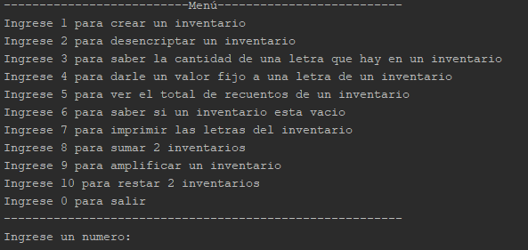

#InventarioLetrasJava

## Descripción 📑

[PDF Del Problema](https://github.com/Kamikazejar/InventarioLetrasJava/blob/a63f2fbe54916a6e31cef8f778294dba6a391185/Trabajo%20de%20Programaci%C3%B3n.pdf)

## ¿Qué he aprendido en este proyecto? 🙇🏻 

Aplicación de POO: Aprendí a implementar y aplicar principios de Programación Orientada a Objetos, como la herencia y el polimorfismo, para resolver problemas específicos.

Abstracción y Encapsulamiento: Aprendí a mantener una abstracción adecuada entre la interfaz de usuario y la implementación, asegurando que los detalles internos estén bien encapsulados.

Manejo de Arrays y Clases en Java: Me familiaricé con el uso de arrays y clases en Java, particularmente en el contexto de manipular cadenas de caracteres y realizar operaciones de cifrado.

Desarrollo Iterativo: Practiqué el desarrollo por etapas, escribiendo y probando código de manera iterativa para asegurar la correcta implementación de cada función antes de avanzar a la siguiente.

Cifrado César: Entendí cómo funciona el cifrado César y lo implementé de manera eficiente, incluyendo la capacidad de encriptar y desencriptar texto.

## Tecnologías 🛠
<!-- Iconos sacados de: https://github.com/hendrasob/badges/blob/master/README.md y https://github.com/alexandresanlim/Badges4-README.md-Profile -->

## Autor ✒️
**Kamikazejar**

* <a href="https://www.linkedin.com/in/rodrigocarmonah/" target="_blank">LinkedIn</a>
* <a href="https://rodrigocarmonaherrera.com/" target="_blank">Portafolio Web</a>
* [Email](mailto:rcarmonah@outlook.com)

  
## Instalación 
*APACHE NET BEANS O OTRO IDE E IMPORTAR EL PROYECTO, Luego en el proyecto click izquierdo y "Run File" *
  
## Licencia 📄
MIT Public License v3.0
No puede usarse comencialmente.
